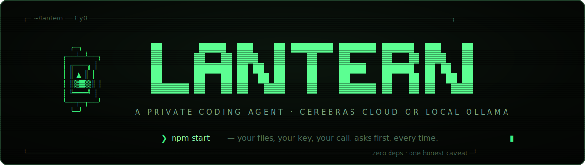
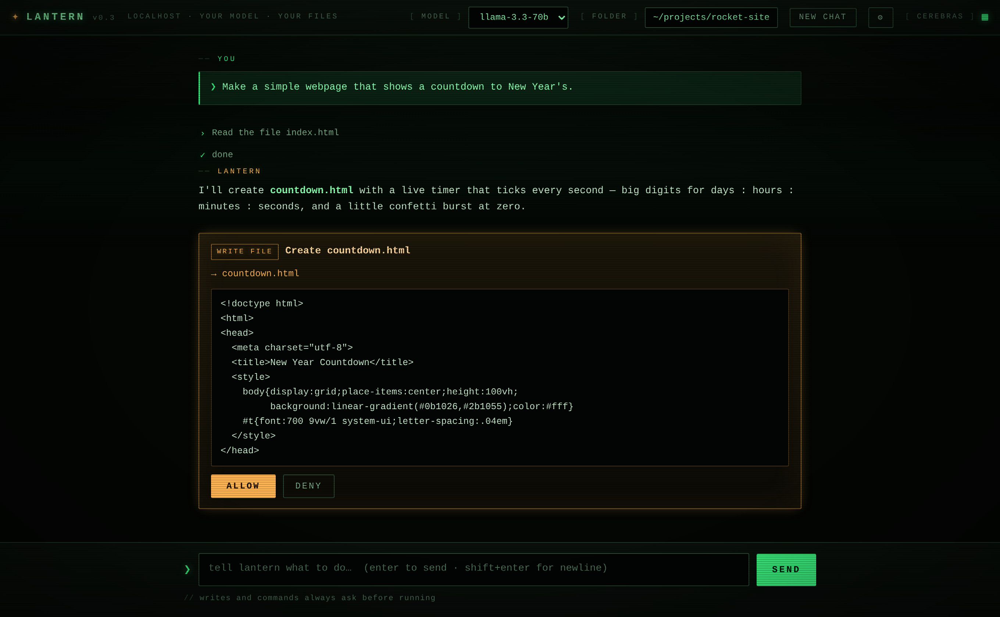
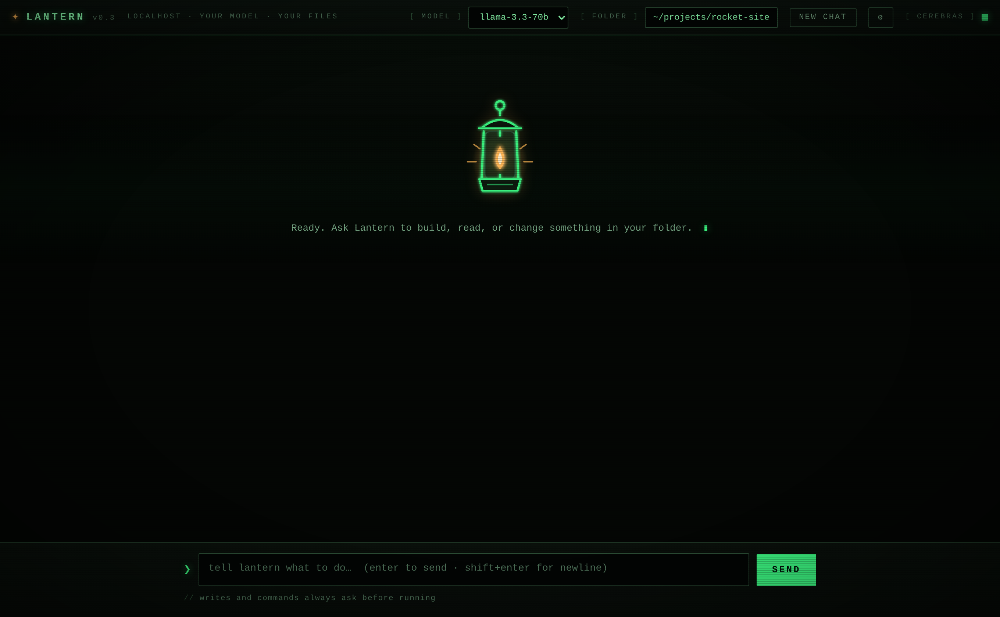
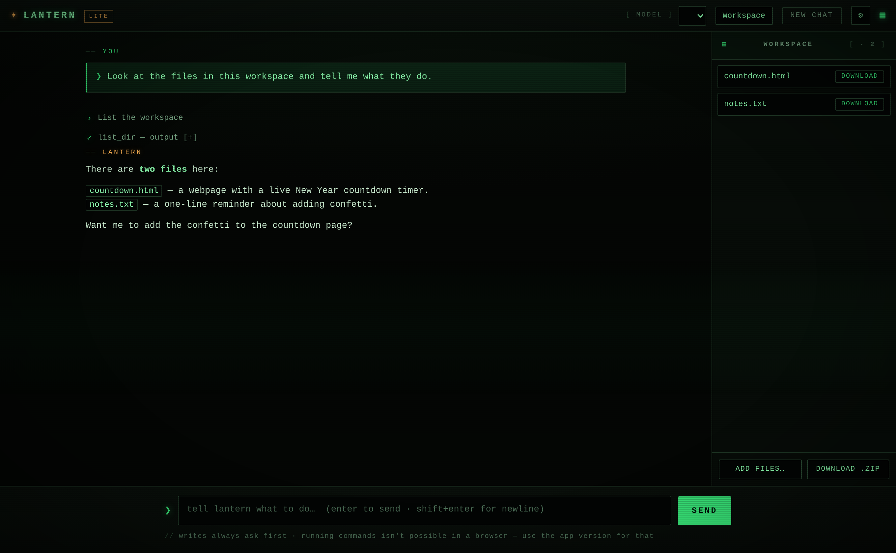
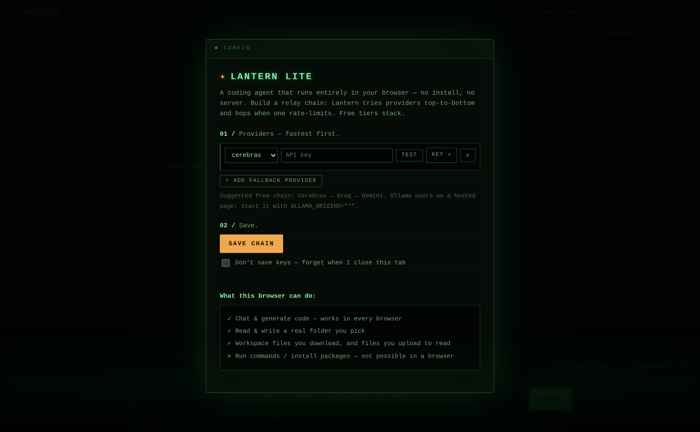

<div align="center">



<br/><br/>

[](LICENSE)
[](https://nodejs.org)
[](package.json)
[](https://ollama.com)
[](https://jammx2.github.io/lantern/)
[](CONTRIBUTING.md)

**A private coding agent that runs on _your_ computer, powered by _your own_ AI — the free Cerebras cloud tier, a fully local model via [Ollama](https://ollama.com), or any OpenAI-compatible endpoint.**

It reads files, writes files, and runs commands in a folder you choose — but it **always shows you
exactly what it's about to do and waits for your OK** before it changes anything.
Nothing goes anywhere except to the provider you chose — and with Ollama, nothing leaves your machine at all.

**[⚡ Try Lantern Lite in your browser →](https://jammx2.github.io/lantern/)** — no install, no server, just your key

Works on **macOS** · **Linux** · **Windows**

</div>

---

## See it

The approval card is the whole idea — nothing writes or runs until you say so:



<table>
  <tr>
    <td width="50%"></td>
    <td width="50%"></td>
  </tr>
  <tr>
    <td align="center"><sub>Power on — the phosphor boot screen</sub></td>
    <td align="center"><sub>Lantern Lite — in-browser workspace</sub></td>
  </tr>
</table>

---

## Two ways to run Lantern

**1. The app** (this repo's `bin`/`src`/`install`). Full power: reads and writes your files *and* runs shell commands (install packages, run scripts, use git). Needs Node.js installed. Best when you can install software on your machine.

**2. Lantern Lite** ([`lantern-lite.html`](lantern-lite.html)). A single file that runs entirely in your browser — **no install, no server, no Node**. For locked-down machines, Chromebooks, or anyone who can't install anything. It can read and write your files, but it **cannot run commands** (browsers don't allow that). [Use the hosted version](https://jammx2.github.io/lantern/), or just double-click the file.

| | The app | Lantern Lite |
|---|---|---|
| Read & write your files | ✅ everywhere | ✅ on Chrome/Edge; upload+download elsewhere |
| Run commands / install packages | ✅ | ❌ not possible in a browser |
| Install required | Node.js | none — just a browser |

Both run the same relay chain, both stream, and both ask before writing anything.

---

## The relay — free tiers, stacked

Lantern doesn't use *a* provider. It holds a **relay chain** of OpenAI-compatible endpoints, tried top-to-bottom — and when one rate-limits you (HTTP 429), it hops to the next **automatically, mid-session**, then benches the limited one for a minute. Your free quotas stack:

| Link | Speed | Free tier | Get a key |
|---|---|---|---|
| **Cerebras** | ~1,800 tok/s | ~1M tokens/day | [cloud.cerebras.ai](https://cloud.cerebras.ai/) |
| **Groq** | 500–3,000+ tok/s | 14,400 requests/day, forever | [console.groq.com/keys](https://console.groq.com/keys) |
| **SambaNova** | 400–600+ tok/s | persistent free tier, huge models | [cloud.sambanova.ai](https://cloud.sambanova.ai/) |
| **Gemini** | fast | generous free tier | [aistudio.google.com/apikey](https://aistudio.google.com/apikey) |
| **Ollama — local** | your hardware | **free forever, offline, fully private** | none — [install](https://ollama.com) + `ollama pull qwen2.5-coder:7b` |

Build the chain at first run (or press **⚙** any time): add a row per provider, **Test**, pick a model, **Save chain**. One provider is fine too — the chain can be a single link.

Responses **stream in live**, token by token, and the header shows which link answered. Lantern also keeps its prompts byte-stable between requests, so providers with prompt caching (Cerebras's cache-aware limits, for one) give you more free tokens and faster starts.

For local models, pick one that supports tool calling — `qwen2.5-coder:7b` or `llama3.1:8b` are good starts.

---

## Get started (non-technical, ~3 minutes)

**1. Get the code.** Download this project (green **Code** button → **Download ZIP**) and unzip it. Or:

```
git clone https://github.com/JAMMx2/lantern.git
```

**2. Install Node.js** (a free tool that runs Lantern), if you don't have it: go to <https://nodejs.org>, download the **LTS** version, install it.

**3. Start Lantern:**

- **macOS:** open the `install` folder and double-click `install-mac.sh` (or in Terminal: `bash install-mac.sh`).
- **Linux:** run `bash install/install-linux.sh`.
- **Windows:** open the `install` folder, right-click `install-windows.ps1` → **Run with PowerShell**.

Your browser opens to Lantern. The first time, it asks you to build your relay chain:

- Quickest start: one **Cerebras** row — free key from cloud.cerebras.ai (no credit card), paste, **Test**, **Save chain**.
- Add **Groq** and **Gemini** rows as fallbacks so a rate limit never stops you.
- **Ollama** (free forever, local): install from ollama.com, run `ollama pull qwen2.5-coder:7b`, add it as the last link.

Then pick the **folder** you want Lantern to work in (top right), choose a **model**, and start typing.

---

## How to use it

Just tell it what you want, in plain language:

- *"Make a simple webpage that shows a countdown to New Year's."*
- *"Look at the files in this folder and tell me what they do."*
- *"Fix the typo in notes.txt where it says 'teh'."*

When Lantern wants to **create/change a file** or **run a command**, it stops and shows you the exact thing in a glowing amber card. Click **Allow** or **Deny**. Reading files inside your chosen folder happens automatically (it can't read anything outside that folder).

Lantern remembers the conversation, so you can say *"now change line 3 of that file"* and it knows which file. Click **New chat** (top right) to start fresh.

---

## What makes it safe

- **You bring your own AI.** Keys are stored only on your computer (in `~/.lantern/config.json`, owner-only permissions) and sent only to the provider you chose. With local Ollama there is no key and no cloud at all.
- **Writes and commands always ask first.** You see the full file or the exact command before it runs.
- **Files stay in the folder you pick.** Lantern can't read or write outside it — including through symlinks that point elsewhere (checked by resolving real paths). No touching the rest of your computer's files.
- **Locked to your machine.** Lantern only listens on your own computer (localhost) and rejects requests from any website open in your browser, using a one-time token and a host check — so a malicious page can't quietly drive the agent.
- **No hidden dependencies.** Lantern is built only with what comes with Node.js. There are no third-party packages to trust. `npm install` is never run.

> One honest caveat: a coding agent that can run shell commands is powerful by design. Commands run with your normal user permissions, which is why every command is shown to you and requires your approval. Only allow commands you understand. When in doubt, click Deny and ask Lantern to explain first.

See [SECURITY.md](SECURITY.md) for the threat model and how to report issues.

---

## Lantern Lite (no install)

Open [`lantern-lite.html`](lantern-lite.html) — double-click it, or use the **[hosted version](https://jammx2.github.io/lantern/)**. Pick your provider — Cerebras key (there's a "don't save it" option for shared computers), local Ollama, or a custom endpoint — and go.



- **On Chrome or Edge:** click **Workspace → pick a folder** to let Lantern read and write real files in that folder (it asks before each write, and can't touch anything outside it).
- **On Safari, Firefox, or when opened directly from disk:** Lantern uses an in-browser workspace instead — files it creates appear on the right to **download** (individually or as a `.zip`), and you can **upload** files to let it read them.
- **Hosting over https is what unlocks real-folder access** on Chrome/Edge — which is why this repo ships with a GitHub Actions workflow that publishes Lite to GitHub Pages automatically (see below).

Your key is stored only in your browser on your device (or not at all, if you chose session-only), and is sent only to your chosen provider. Using Ollama from the hosted page? Start it with `OLLAMA_ORIGINS="*"` so the browser may connect.

### Deploy your own copy

1. **Fork** this repo (top right).
2. In your fork: **Settings → Pages → Source: GitHub Actions**.
3. Push anything (or run the *Deploy Lantern Lite* workflow from the **Actions** tab).
4. Your copy is live at `https://<your-username>.github.io/lantern/`.

---

## For developers

```
lantern/
  lantern-lite.html   # serverless browser version (open or host; no Node needed)
  bin/lantern.js      # CLI: starts the local server, opens the browser
  src/
    server.js         # native http server, NDJSON streaming, approval bridge
    agent.js          # the tool-calling loop
    cerebras.js       # OpenAI-compatible Cerebras client (chat + /models)
    tools.js          # list_dir / read_file / write_file / run_command + confinement
    config.js         # ~/.lantern/config.json
  public/index.html   # the whole UI (single file, vanilla JS, zero deps, CRT included)
  install/            # per-OS launchers
  docs/assets/        # banner + screenshots
  .github/workflows/  # auto-deploy of Lantern Lite to GitHub Pages
```

- **Requirements:** Node 18+ (uses native `fetch`, `http`, `fs`, `child_process`). No `npm install` needed.
- **Run directly:** `node bin/lantern.js` (or `npm start`). Set `PORT` to change the port (default 4317; it auto-increments if busy).
- **API:** any OpenAI-compatible endpoint works — Cerebras, Groq, SambaNova, Gemini (OpenAI mode), Ollama, LM Studio… The relay lives in `src/cerebras.js`: streaming SSE client with incremental tool-call assembly, plus per-provider cooldown benching (60s after a 429). Model lists are fetched live and filtered to chat-capable models.
- **Events:** the server streams NDJSON — `provider`, `assistant_delta`, `assistant_done`, `tool_request`, `tool_result`, `error`, `done`.
- **Extending:** add a tool by (1) implementing it in `tools.js`, (2) adding its JSON schema to `TOOL_DEFS`, (3) deciding whether it belongs in `NEEDS_APPROVAL`.
- **The UI** is a deliberate retro phosphor terminal — scanlines, glow, and approval cards are pure CSS. No images, fonts, or scripts are loaded from anywhere. If you rename the product, change the name in `package.json`, the wordmarks in `public/index.html` + `lantern-lite.html`, and the config folder in `src/config.js`.

Contributions welcome — see [CONTRIBUTING.md](CONTRIBUTING.md).

---

## License

[MIT](LICENSE) © 2026 JAMMx2

<div align="center">

`> telemetry .............. none` ✦ `> cloud lock-in .......... none`

</div>
